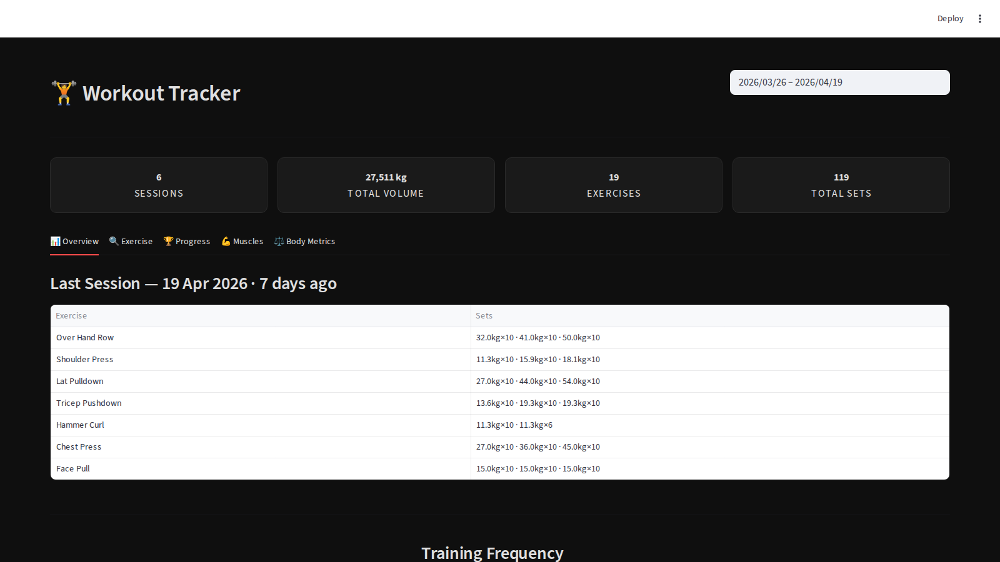
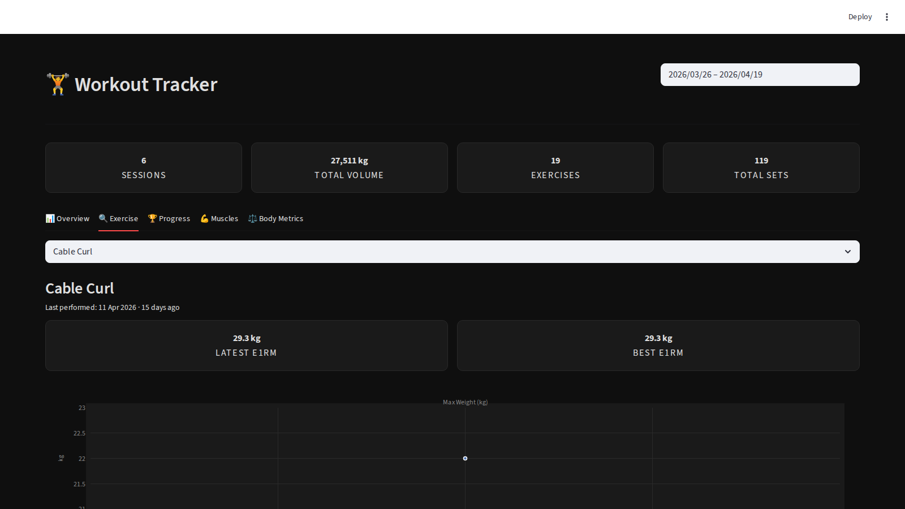
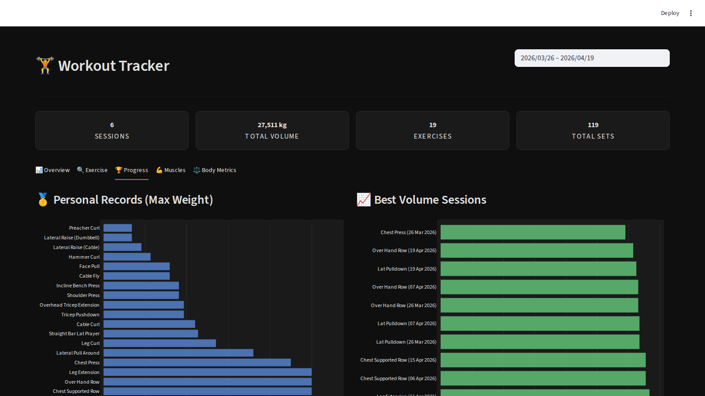
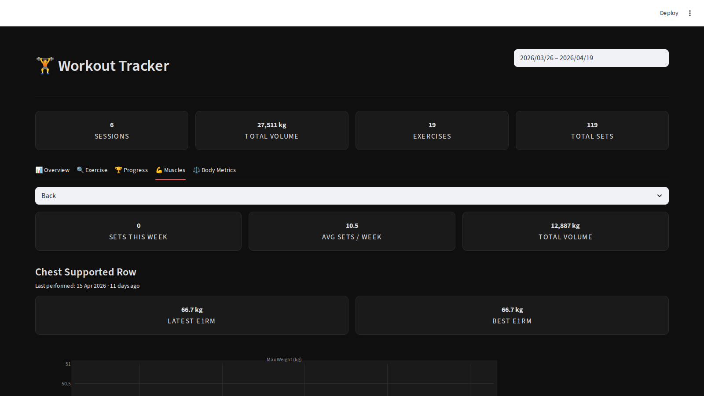
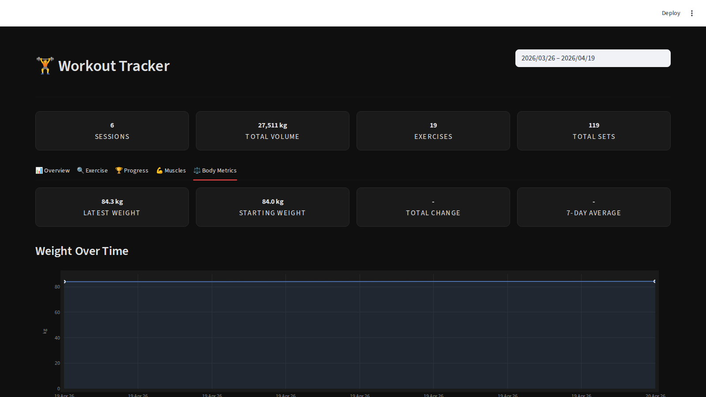

# Workout Tracker

A personal fitness dashboard built with Streamlit. Syncs workout and body weight logs from Google Drive, parses them automatically, and renders interactive dark-themed analytics across five views.


---

## Screenshots

### Overview
Last session log, training frequency heatmap, and weight/volume grids across all exercises.



### Exercise
Drill into any movement — max weight, volume, and e1RM trends over time.



### Progress
Personal records, best volume sessions, and cumulative volume trend.



### Muscles
Filter by muscle group — sets per week, average volume, and exercise breakdown.



### Body Metrics
Body weight over time with weekly averages and total change.



---

## Tech Stack

| Layer | Library |
|---|---|
| UI & Routing | Streamlit |
| Charts | Plotly |
| Data | Pandas |
| Cloud Sync | Google Drive API |
| Auth | Google OAuth 2.0 |
| Package Manager | uv |

---

## Project Structure

```
├── dashboard.py          # App entry point
├── launch.sh             # One-command launcher
├── workout/
│   ├── gdrive.py         # Google Drive sync & OAuth
│   ├── parser.py         # Markdown → structured data
│   ├── storage.py        # CSV caching & calculated columns
│   ├── plots.py          # All Plotly chart functions
│   ├── ui.py             # Dark theme CSS & KPI cards
│   └── views/            # One module per tab
│       ├── overview.py
│       ├── exercise.py
│       ├── progress.py
│       ├── muscles.py
│       └── body.py
├── config/
│   ├── exercises.json    # Shorthand → full exercise name
│   ├── muscles.json      # Exercise → muscle group
│   └── muscle_diagrams.json
└── assets/               # Anatomical muscle diagram PNGs
```

---

## How to Use

### 1. Prerequisites

- Python 3.12+
- [uv](https://github.com/astral-sh/uv) package manager
- A Google account with Drive API enabled

### 2. Clone the repo

```bash
git clone https://github.com/huzibw618/WorkoutTracker.git
cd WorkoutTracker
```

### 3. Set up Google Drive credentials

1. Go to [Google Cloud Console](https://console.cloud.google.com/) → **APIs & Services** → **Credentials**
2. Click **Create Credentials** → **OAuth 2.0 Client ID** → Application type: **Desktop app**
3. Download the JSON file and save it as `credentials.json` in the project root

Use `credentials.example.json` as a reference for the expected structure.

### 4. Prepare your data files on Google Drive

The app looks for **one folder** in your Drive root named exactly **`Workouts`**, containing two ZIP files:

```
Google Drive/
└── Workouts/
    ├── Workout        ← ZIP containing Workouts/Workouts.md
    └── Weight         ← ZIP containing Weight/Weight.md
```

> The folder name must be `Workouts`, the ZIP files must be named `Workout` and `Weight` (no extension).

**Inside `Workout.zip`** — path must be `Workouts/Workouts.md`:

```
April 20
BP: 60,70,80;kg;10,8,6
SP: 40,45;kg;10,8
LPD: 50,60;kg;10,8

April 22
SQ: 80,90,100;kg;8,6,5
```

Each session starts with `Month Day` on its own line, followed by one exercise per line in the format:
```
SHORTHAND: weight1,weight2,...;unit;reps1,reps2,...
```

Units are `kg` or `lbs`. Shorthands are defined in `config/exercises.json` — for example `BP` → Bench Press, `SP` → Shoulder Press, `LPD` → Lat Pulldown.

**Inside `Weight.zip`** — path must be `Weight/Weight.md`:

```
| Date       | Weight | Unit |
|------------|--------|------|
| 2026-04-20 | 84.3   | kg   |
| 2026-04-19 | 84.0   | kg   |
```

### 5. Run

```bash
./launch.sh
```

Or directly:

```bash
uv run streamlit run dashboard.py
```

On first run a browser window opens for Google OAuth consent. After approval, `token.json` is saved locally — you won't be prompted again.

The app opens at **http://localhost:8501**.

---

## Data Flow

```
Google Drive
└── Workouts/ (folder)
    ├── Workout (zip)  →  data/Workouts/Workouts.md
    └── Weight  (zip)  →  data/Weight/Weight.md
                                  ↓
                            parser.py
                                  ↓
                     Structured DataFrames
                                  ↓
              storage.py — CSV cache + volume / e1RM columns
                                  ↓
                       plots.py + views/
                                  ↓
                      Streamlit Dashboard
```

---

## Configuration

| File | Purpose |
|---|---|
| `credentials.json` | OAuth client secrets — **never commit**, see `credentials.example.json` |
| `token.json` | Auto-generated on first login — never commit |
| `config/exercises.json` | Maps shorthand codes to full exercise names |
| `config/muscles.json` | Maps exercises to muscle groups |
